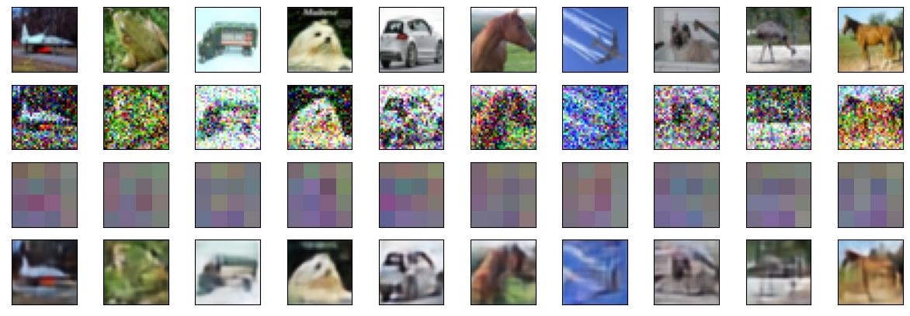

# CNN_AutoEncoder_Denoising

result of the model using 'cifar10' dataset in the `tensorflow_datasets`

some features of autoencoder:
1. autoencoder can learn dense representations of input data without supervision, which is useful for dimensionality reduction and for visualization.
2. can be used to generate new data that ensembles input data

